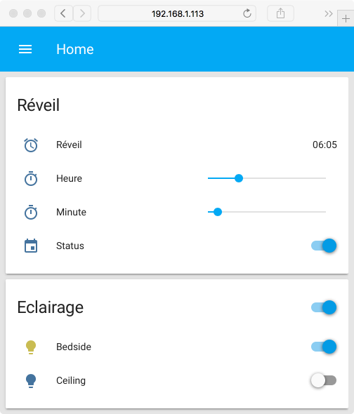

# Configuration - Alarm Clock - Home Assistant
A simple configuration example to create an alarm clock and trigger an automation, which turns on the light and switches on a stereo. This example was tested on [Home Assistant](https://home-assistant.io) 0.64.1 and uses the Philips [Hue](https://home-assistant.io/components/light.hue/) component and an [Onkyo](https://home-assistant.io/components/media_player.onkyo/) media player.

## Configuration
configuration.yaml :
```yaml
homeassistant:
  # Customization file
  customize: !include customize.yaml

hue:
  bridges:
   - host: 192.168.1.130

recorder:
  include:
    entities:
      - input_number.alarm_clock_hours
      - input_number.alarm_clock_minutes
      - input_boolean.alarm_clock_status

sensor: !include sensors.yaml
input_number: !include input_numbers.yaml
input_boolean: !include input_booleans.yaml
media_player: !include media_players.yaml
group: !include groups.yaml
automation: !include automations.yaml
```

customize.yaml :
```yaml
input_number.alarm_clock_hours:
  friendly_name: 'Heure'
  icon: mdi:timer
input_number.alarm_clock_minutes:
  friendly_name: 'Minute'
  icon: mdi:timer
input_boolean.alarm_clock_status:
  friendly_name: 'Etat'
  icon: mdi:calendar
sensor.alarm_clock_hours:
  hidden: true
sensor.alarm_clock_minutes:
  hidden: true
sensor.alarm_clock_time:
  friendly_name: 'Heure du réveil'
  icon: mdi:alarm
```

sensors.yaml :
```yaml
- platform: template
  sensors:
    alarm_clock_hours:
      value_template: "{{ states('input_number.alarm_clock_hours') | round(0) }}"
    alarm_clock_minutes:
      value_template: "{{ states('input_number.alarm_clock_minutes') | round(0) }}"
    alarm_clock_time:
      value_template: "0{{ states.sensor.alarm_clock_hours.state }}:0{{ states.sensor.alarm_clock_minutes.state }}"
- platform: time_date
  display_options:
    - 'time'
```

input_numbers.yaml :
```yaml
alarm_clock_hours:
  min: 0
  max: 23
  step: 1
  mode: slider
alarm_clock_minutes:
  min: 0
  max: 55
  step: 5
  mode: slider
```

input_booleans.yaml :
```yaml
alarm_clock_status:
  initial: on
```

media_players.yaml :
```yaml
- platform: onkyo
  host: 192.168.1.133
  name: 'Stereo'
```

groups.yaml :
```yaml
default_view:
  view: yes
  entities:
    - group.alarm_clock

alarm_clock:
  name: 'Réveil'
  entities:
    - sensor.alarm_clock_time
    - input_number.alarm_clock_hours
    - input_number.alarm_clock_minutes
    - input_boolean.alarm_clock_status
```

automations.yaml :
```yaml
- alias: 'Turn on the alarm clock'
  trigger:
    platform: template
    value_template: '{{ states.sensor.time.state == states.sensor.alarm_clock_time.state }}'
  condition:
    condition: and
    conditions:
     - condition: state
       entity_id: input_boolean.alarm_clock_status
       state: 'on'
     - condition: time
       weekday:
         - mon
         - tue
         - wed
         - thu
         - fri
  action:
    - service: media_player.turn_on
      data:
        entity_id: media_player.stereo
    - service: media_player.volume_set
      data:
        entity_id: media_player.stereo
        volume_level: 0.07
    - service: media_player.select_source
      data:
        entity_id: media_player.stereo
        source: dab
    - service: light.turn_on
      data:
        entity_id: light.bedside
        brightness: 255
        transition: 900
    - delay:
        minutes: 15
    - service: light.turn_on
      data:
        entity_id: light.ceiling
        brightness: 255
    - service: light.turn_off
      data:
        entity_id: light.bedside
```

## Preview

