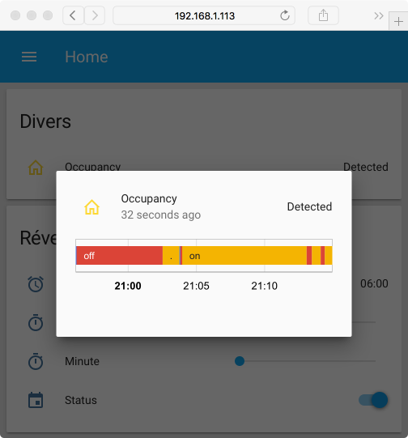

# MQTT Binary Sensor - Bluetooth LE Device Tracker - Home Assistant
A simple example describing how to track a Bluetooth Low Energy device with an ESP32, the MQTT protocol and Home Assistant. Please note that the targeted device can't have a changing BLE address (normally called random instead of public address).  


## Configuration
To configure this sketch, you have to rename the header file `example.config.h` in `config.h`, provide the Bluetooth device(s) to track and add your Wi-Fi and MQTT credentials in the `SOFTWARE SECTION`.

### Bluetooth Device(s)
```
#define NB_OF_BLE_TRACKED_DEVICES 1
BLETrackedDevice BLETrackedDevices[NB_OF_BLE_TRACKED_DEVICES] = {
  {"11:22:33:44:55:66", false, 0, false, {0}}
};

// Location of the BLE scanner
#define LOCATION "bedroom"
```
or with multiple devices
```
#define NB_OF_BLE_TRACKED_DEVICES 3
BLETrackedDevice BLETrackedDevices[NB_OF_BLE_TRACKED_DEVICES] = {
  {"11:22:33:44:55:66", false, 0, false, {0}},
  {"11:22:33:44:55:66", false, 0, false, {0}},
  {"11:22:33:44:55:66", false, 0, false, {0}}
};

// Location of the BLE scanner
#define LOCATION "bedroom"
```

### Credentials
```
// Wi-Fi credentials
#define WIFI_SSID     ""
#define WIFI_PASSWORD ""

// MQTT
#define MQTT_USERNAME     ""
#define MQTT_PASSWORD     ""
#define MQTT_SERVER       ""
#define MQTT_SERVER_PORT  1883
```

### Home Assistant
To add the occupancy sensor to Home Assistant, please edit and add this snippet into your configuration. Make sure to replace `<CHIP_ID`, `<LOCATION>` and `<BLE_ADDRESS>` with the values defined in `config.h`.

```yaml
# Example configuration.yaml entry
binary_sensor:
  - platform: mqtt
    name: 'Occupancy'
    state_topic: '<CHIP_ID>/sensor/<LOCATION>/<BLE_ADDRESS>/state'
    availability_topic: '<CHIP_ID/availability'
    device_class: occupancy
```



## Licence
> THE SOFTWARE IS PROVIDED "AS IS", WITHOUT WARRANTY OF ANY KIND, EXPRESS OR
  IMPLIED, INCLUDING BUT NOT LIMITED TO THE WARRANTIES OF MERCHANTABILITY,
  FITNESS FOR A PARTICULAR PURPOSE AND NONINFRINGEMENT. IN NO EVENT SHALL THE
  AUTHORS OR COPYRIGHT HOLDERS BE LIABLE FOR ANY CLAIM, DAMAGES OR OTHER
  LIABILITY, WHETHER IN AN ACTION OF CONTRACT, TORT OR OTHERWISE, ARISING FROM,
  OUT OF OR IN CONNECTION WITH THE SOFTWARE OR THE USE OR OTHER DEALINGS IN THE
  SOFTWARE.

*If you like the content of this repo, please add a star! Thank you!*
