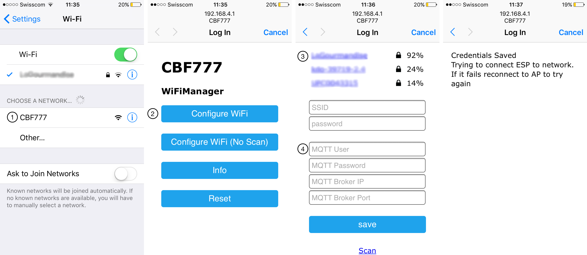

# MQTT Binary Sensor - Door - Home Assistant
A simple example to monitor the state of a door with a NodeMCU board (ESP8266).

## Configuration
configuration.yaml :
```yaml
binary_sensor:
  platform: mqtt
  name: 'Door'
  state_topic: 'CBF777/binary_sensor/door/state'
  sensor_class: opening
```

## Schematic
Door sensor
- Door sensor leg 1 - D1
- Door sensor leg 2 - GND

Button
- Switch leg 1 - VCC
- Switch leg 2 - D2 - Resistor 10K Ohms - GND

## Wi-Fi and MQTT Configuration

