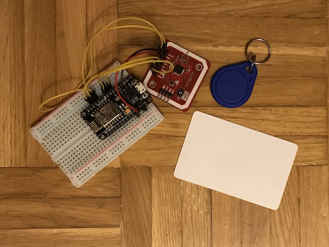
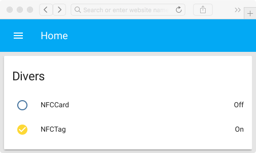

# MQTT Binary Sensor - NFC Tags Scanner - Home Assistant
A simple example describing how to scan NFC tags with an ESP8266 and send the results through MQTT to Home Assistant.



## Schematic
Requirements :
- PN532 NFC RFID (Elechouse module v3)
- ESP8266 (NodeMCU v1.0)

| NFC reader | NodeMCU / ESP8266  |
|------------|--------------------|
| SS (CS)    | D2 (GPIO4)         |
| SCK        | D5 (GPIO14)        |
| MISO       | D6 (GPIO12)        |
| MOSI       | D7 (GPIO13)        |
| VCC        | VCC (3V3)          |
| GND        | GND                |

## Configuration
To configure this sketch, you have to rename the header file `example.config.h` in `config.h`, provide the NFC tag's UID to track, its desired name (for example `MifareTag`) and add your Wi-Fi and MQTT credentials in the `SOFTWARE SECTION`.

### NFC Tags
```
#define NB_OF_NFC_TRACKED_TAGS 1
NFCTag NFCTags[NB_OF_NFC_TRACKED_TAGS] = {
  {{0x11, 0x22, 0x33, 0x44, 0x0, 0x0, 0x0}, "MifareTag", false, 0, false, {0}}
};

// Location of the NFC scanner
#define LOCATION "office"
```
or with multiple tags
```
#define NB_OF_NFC_TRACKED_TAGS 2
NFCTag NFCTags[NB_OF_NFC_TRACKED_TAGS] = {
  {{0x11, 0x22, 0x33, 0x44, 0x0, 0x0, 0x0}, "MifareTag", false, 0, false, {0}},
  {{0x12, 0x23, 0x34, 0x45, 0x0, 0x0, 0x0}, "MifareCard", false, 0, false, {0}},
};
```

### Credentials
```
// Wi-Fi credentials
#define WIFI_SSID     ""
#define WIFI_PASSWORD ""

// MQTT
#define MQTT_USERNAME     ""
#define MQTT_PASSWORD     ""
#define MQTT_SERVER       ""
#define MQTT_SERVER_PORT  1883
```

### Home Assistant
To retrieve and use the results obtained with the NFC scanner into Home Assistant, please edit and add this snippet into your configuration. Make sure to replace `<CHIP_ID`, `<LOCATION>` and `<NFC_TAG_NAME>` with the values defined in `config.h`.

```yaml
# Example configuration.yaml entry
binary_sensor:
  - platform: mqtt
    name: 'NFC Tag'
    state_topic: '<CHIP_ID>/sensor/<LOCATION>/<NFC_TAG_NAME>/state'
    availability_topic: '<CHIP_ID>/availability'
  - platform: mqtt
    name: 'NFC Card'
    state_topic: '<CHIP_ID>/sensor/<LOCATION>/<NFC_TAG_NAME>/state'
    availability_topic: '<CHIP_ID>/availability'
```



## Licence
> THE SOFTWARE IS PROVIDED "AS IS", WITHOUT WARRANTY OF ANY KIND, EXPRESS OR
  IMPLIED, INCLUDING BUT NOT LIMITED TO THE WARRANTIES OF MERCHANTABILITY,
  FITNESS FOR A PARTICULAR PURPOSE AND NONINFRINGEMENT. IN NO EVENT SHALL THE
  AUTHORS OR COPYRIGHT HOLDERS BE LIABLE FOR ANY CLAIM, DAMAGES OR OTHER
  LIABILITY, WHETHER IN AN ACTION OF CONTRACT, TORT OR OTHERWISE, ARISING FROM,
  OUT OF OR IN CONNECTION WITH THE SOFTWARE OR THE USE OR OTHER DEALINGS IN THE
  SOFTWARE.

*If you like the content of this repo, please add a star! Thank you!*
