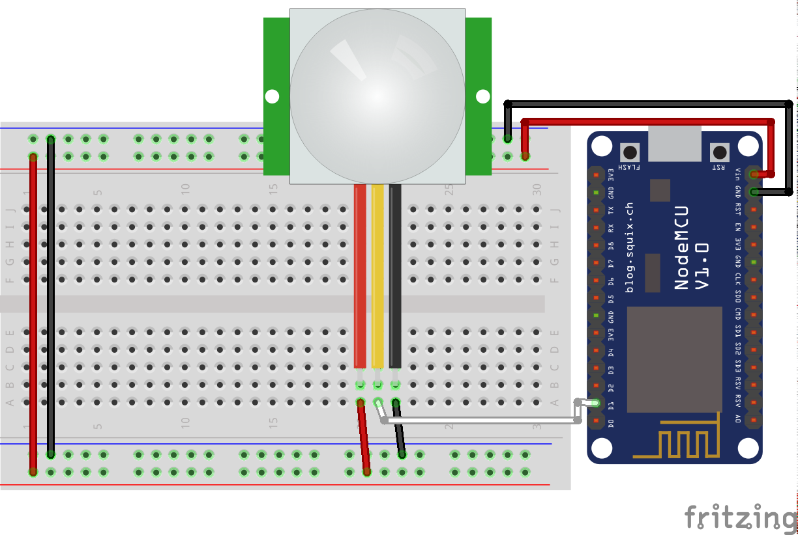

# MQTT Binary Sensor - Motion - Home Assistant
A simple example to use a PIR motion sensor cnnected to a NodeMCU board (ESP8266).

## Configuration
configuration.yaml :
```yaml
binary_sensor:
  platform: mqtt
  state_topic: 'office/motion/status'
  name: 'Motion'
  sensor_class: motion
```

## Schematic
- PIR leg 1 - VCC
- PIR leg 2 - D1/GPIO5
- PIR leg 3 - GND

