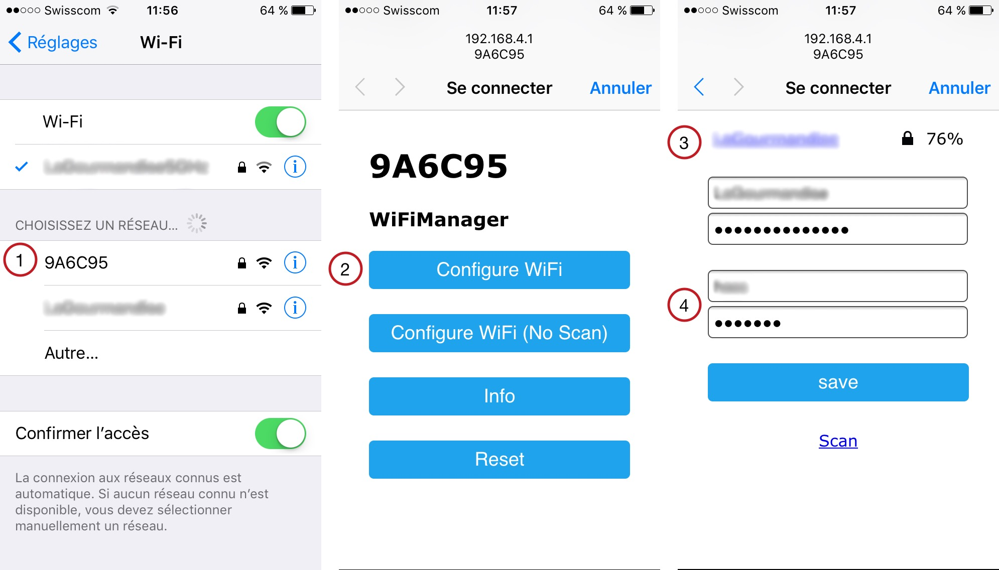

# MQTT Light - Home-Assistant
A simple example to control the built-in led connected to a NodeMCU board (ESP8266).

## Advanced features
- WiFiManager: To list the available Wifi AP and to connect to one of them.
- mDNS:        To look for the IP address and the port of the local MQTT broker.
- OTA:         To update the firmware over-the-air.

## Configuration
### MQTT broker server
Steps:
- sudo apt-get install avahi-deamon (installed by default)
- sudo nano /etc/avahi/services/mqtt.service
- Copy/paste the following lines:
```xml
<?xml version="1.0" standalone='no'?>
<!DOCTYPE service-group SYSTEM "avahi-service.dtd">
<service-group>
    <name replace-wildcards="yes">%h</name>
    <service>
        <type>_mqtt._tcp</type>
        <port>1883</port>
    </service>
</service-group>
```
- sudo service avahi-daemon restart

### Home-Assistant
Warning: 'F90D5F' corresponds to the chip ID of my ESP8266.
Your chip ID is visible in the logs and corresponds to the name of the initial AP.

configuration.yaml :
```yaml
light:
  platform: mqtt
  name: 'Office light'
  state_topic: '9A6C95/light'
  command_topic: '9A6C95/light/switch'
  optimistic: false
```

## Steps
1. Select the Wifi AP provided by the ESP8266. A window is open,
2. Select "Configure WiFi",
3. Choose your Wifi AP in the list and enter your password,
4. Enter the MQTT username and password. Press "save",
5. Configure Home-Assitant.



