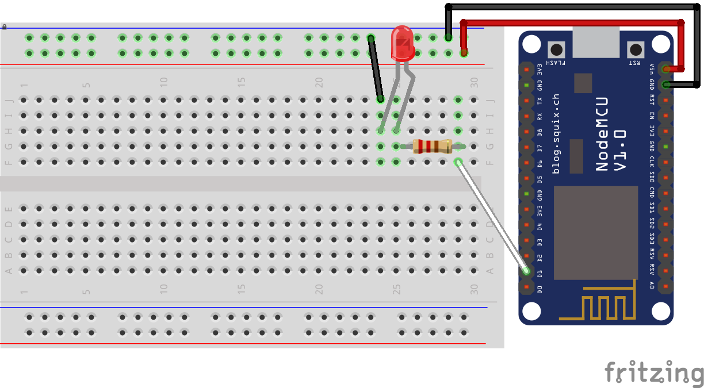

# MQTT Light with brightness support - Home Assistant
A simple example to control a led connected to a NodeMCU board (ESP8266).

## Configuration
configuration.yaml :
```yaml
light:
  - platform: mqtt
    name: 'Office light'
    state_topic: 'office/light'
    command_topic: 'office/light/switch'
    brightness_state_topic: 'office/light/brightness'
    brightness_command_topic: 'office/light/brightness/set'
    optimistic: false
```

## Schematic
- GND - Resistor 220 Ohms - LED leg 1
- D1/GPIO5 - LED leg 2 (longuest one)


