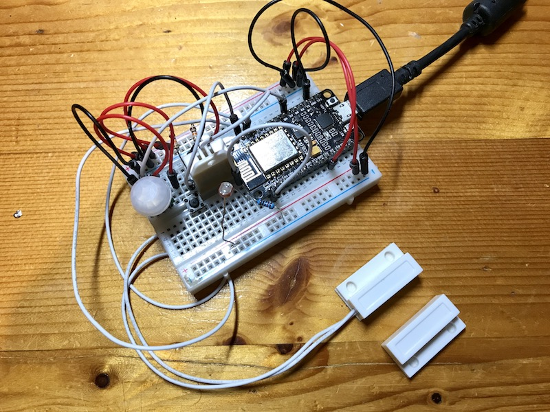

# MQTT - MultiSensor - Home Assistant
A full example describing how to monitor your environment with an ESP8266, the MQTT protocol and Home Assistant.

## Features
- Temperature (DHT22, SHT3X)
- Humidity (DHT22, SHT3X)
- Luminosity (Photoresistor, TEMT6000)
- Motion (AM312)
- Door/Window state ON/OFF
- Button state ON/OFF

## Schematic
### DHT22 sensor
Temperature and Humidity sensor. Schematic available [here](https://github.com/mertenats/Open-Home-Automation/tree/master/ha_mqtt_sensor_dht22).

- DHT22 leg 1 - VCC
- DHT22 leg 2 - D2 - Resistor 4.7K Ohms - GND
- DHT22 leg 4 - GND

### SHT3X sensor
Temperature and Humidity sensor.

- SHT3X VCC - VCC
- SHT3X GND - GND
- SHT3X SCL - D2
- SHT3X SDA - D3

### Photoresistor
Luminosity sensor. Schematic available [here](https://github.com/mertenats/Open-Home-Automation/tree/master/ha_mqtt_sensor_photocell).

- Photocell leg 1 - VCC
- Photocell leg 2 - A0 - Resistor 10K Ohms - GND

### TEMT6000
Luminosity sensor.

- TEMT6000 VCC - VCC
- TEMT6000 GND - GND
- TEMT6000 OUT - A0

### AM312 sensor
Motion sensor. Schematic available [here](https://github.com/mertenats/Open-Home-Automation/tree/master/ha_mqtt_binary_sensor_pir).

- PIR leg 1 - VCC
- PIR leg 2 - D7
- PIR leg 3 - GND

### Magnet
Door/Window state sensor. Schematic available [here](https://github.com/mertenats/Open-Home-Automation/tree/master/ha_mqtt_binary_sensor_door).

- Door sensor leg 1 - D3
- Door sensor leg 2 - GND

### Button
Button ON/OFF. Schematic available [here](https://github.com/mertenats/Open-Home-Automation/tree/master/ha_mqtt_switch).

- Switch leg 1 - VCC
- Switch leg 2 - D1 - Resistor 10K Ohms - GND



## Configuration
To configure this sketch, you have to rename the header file `example.config.h` in `config.h`. Then, it is possible to enable/disable sensors in the `HARDWARE SECTION` or edit your Wi-Fi and MQTT credentials in the `SOFTWARE SECTION`.

### Sensors
```
// Door sensor
#define DOOR_SENSOR                     D3

// Motion sensor
#define PIR_SENSOR                      D7

// Photoresistor sensor
#define LDR_SENSOR                      A0

// Temperature and humidity sensor (DHT22)
#define DHT22_SENSOR                  D2

// Button
#define BUTTON_SENSOR                   D1
```

### Credentials
```
// Wi-Fi credentials
#define WIFI_SSID     ""
#define WIFI_PASSWORD ""

// MQTT
#define MQTT_USERNAME     ""
#define MQTT_PASSWORD     ""
#define MQTT_SERVER       ""
#define MQTT_SERVER_PORT  1883
```

### Home Assistant
To add the motion sensor, the door/window state sensor and the button to Home Assistant, please edit and add this snippet into your configuration.

```yaml
# Example configuration.yaml entry
binary_sensor:
  - platform: mqtt
    name: 'Motion'
    state_topic: '<CHIP_ID>/sensor/motion'
    availability_topic: '<CHIP_ID>/status'
    payload_available: 'online'
    payload_not_available: 'offline'
    device_class: motion
  - platform: mqtt
    name: 'Door'
    state_topic: '<CHIP_ID>/sensor/door'
    availability_topic: '<CHIP_ID>/status'
    payload_available: 'online'
    payload_not_available: 'offline'
    device_class: opening
  - platform: mqtt
    name: 'Button'
    state_topic: '<CHIP_ID>/sensor/button'
    availability_topic: '<CHIP_ID>/status'
    payload_available: 'online'
    payload_not_available: 'offline'
```

To add the temperature and humidity sensor and the luminosity sensor, please edit and add this snippet into your configuration.

```yaml
# Example configuration.yml entry
sensor:
  - platform: mqtt
    name: 'Temperature'
    state_topic: '<CHIP_ID>/sensor/temperature'
    unit_of_measurement: '°C'
    availability_topic: '<CHIP_ID>/status'
    payload_available: 'online'
    payload_not_available: 'offline'
  - platform: mqtt
    name: 'Humidity'
    state_topic: '<CHIP_ID>/sensor/humidity'
    unit_of_measurement: '%'
    availability_topic: '<CHIP_ID>/status'
    payload_available: 'online'
    payload_not_available: 'offline'
  - platform: mqtt
    name: 'Luminosity'
    state_topic: '<CHIP_ID>/sensor/lux'
    unit_of_measurement: 'lux'
    availability_topic: '<CHIP_ID>/status'
    payload_available: 'online'
    payload_not_available: 'offline'
```

## Licence
> THE SOFTWARE IS PROVIDED "AS IS", WITHOUT WARRANTY OF ANY KIND, EXPRESS OR
  IMPLIED, INCLUDING BUT NOT LIMITED TO THE WARRANTIES OF MERCHANTABILITY,
  FITNESS FOR A PARTICULAR PURPOSE AND NONINFRINGEMENT. IN NO EVENT SHALL THE
  AUTHORS OR COPYRIGHT HOLDERS BE LIABLE FOR ANY CLAIM, DAMAGES OR OTHER
  LIABILITY, WHETHER IN AN ACTION OF CONTRACT, TORT OR OTHERWISE, ARISING FROM,
  OUT OF OR IN CONNECTION WITH THE SOFTWARE OR THE USE OR OTHER DEALINGS IN THE
  SOFTWARE.

*If you like the content of this repo, please add a star! Thank you!*
