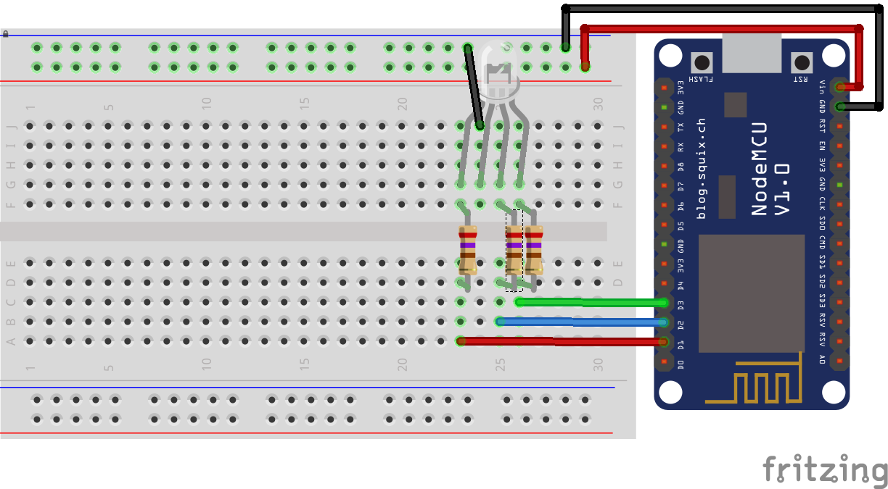
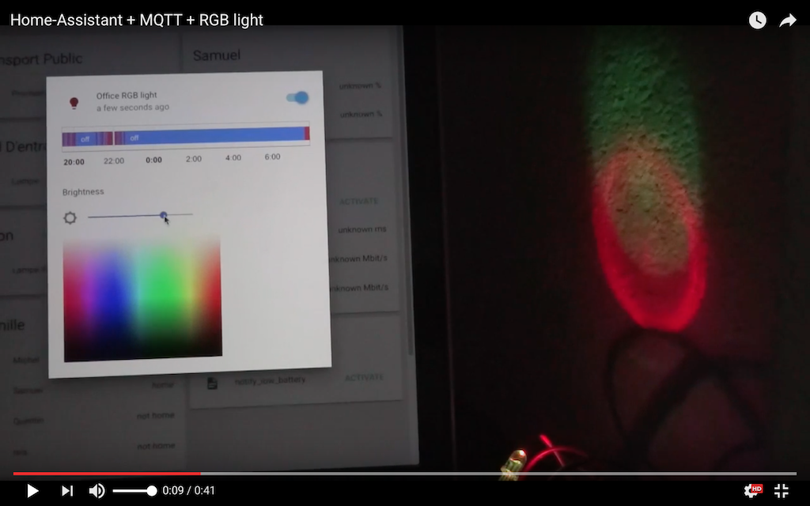

# MQTT RGB Light - Home-Assistant
A simple example to control a RGB led connected to a NodeMCU board (ESP8266).

## Configuration
configuration.yaml :
```yaml
light:
  platform: mqtt
  name: 'Office RGB light'
  state_topic: 'office/rgb1/light/status'
  command_topic: 'office/rgb1/light/switch'
  brightness_state_topic: 'office/rgb1/brightness/status'
  brightness_command_topic: 'office/rgb1/brightness/set'
  rgb_state_topic: 'office/rgb1/rgb/status'
  rgb_command_topic: 'office/rgb1/rgb/set'
  brightness_scale: 100
  optimistic: false
```

## Schematic
- LED leg 1 - Resistor 270 Ohms - D1/GPIO5
- LED leg 2 (longuest leg) - GND
- LED leg 3 - Resistor 270 Ohms - D2/GPIO4
- LED leg 4 - Resistor 270 Ohms - D3/GPIO0



## Demo
[](https://www.youtube.com/watch?v=7rMpCZ9I2BU "Home-Assistant + MQTT + RGB light")
