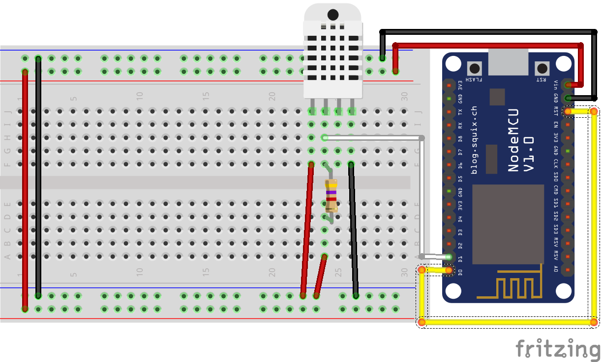

# MQTT Sensor - Temperature and Humidity - Home-Assistant
A simple example to get temperature and humidity every ten minutes from a DHT22 sensor connected to a NodeMCU board (ESP8266).

## Configuration
configuration.yaml :
```yaml
sensor 1:
  platform: mqtt
  state_topic: 'office/sensor1'
  name: 'Temperature'
  unit_of_measurement: '°C'
  value_template: '{{ value_json.temperature }}'

sensor 2:
  platform: mqtt
  state_topic: 'office/sensor1'
  name: 'Humidity'
  unit_of_measurement: '%'
  value_template: '{{ value_json.humidity }}'
```

## Schematic
- DHT22 leg 1 - VCC
- DHT22 leg 2 - D1/GPIO5 - Resistor 4.7K Ohms - GND
- DHT22 leg 4 - GND
- D0/GPIO16 - RST (wake-up purpose)


