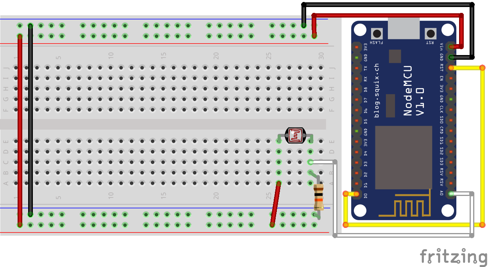

# MQTT Sensor - Brightness - Home-Assistant
A simple example to get the brightness (0 - 100%) of the room every ten minutes from a photocell connected to a NodeMCU board (ESP8266).

## Configuration
configuration.yaml :
```yaml
sensor 1:
  platform: mqtt
  state_topic: 'office/sensor1'
  name: 'Brightness'
  unit_of_measurement: '%'
  value_template: '{{ value_json.brightness }}'
```

## Schematic
- Photocell leg 1 - VCC
- Photocell leg 2 - A0 - Resistor 10K Ohms - GND
- D0/GPIO16 - RST (wake-up purpose)

