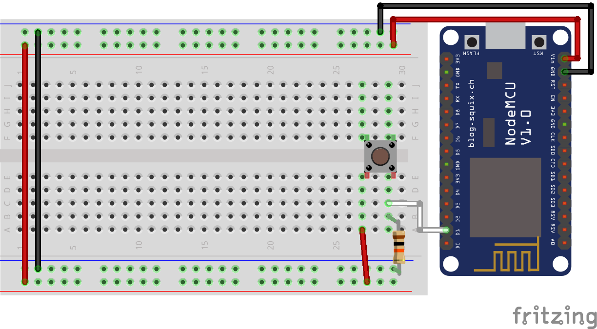

# MQTT Switch - Home Assistant
A simple example to control a switch onnected to a NodeMCU board (ESP8266).

## Configuration
configuration.yaml :
```yaml
switch:
  platform: mqtt
  name: 'Office Switch'
  state_topic: 'office/switch1/status'
  command_topic: 'office/switch1/set'
  retain: true
  optimistic: false
```

## Schematic
- Switch leg 1 - VCC
- Switch leg 2 - D1/GPIO5 - Resistor 10K Ohms - GND

