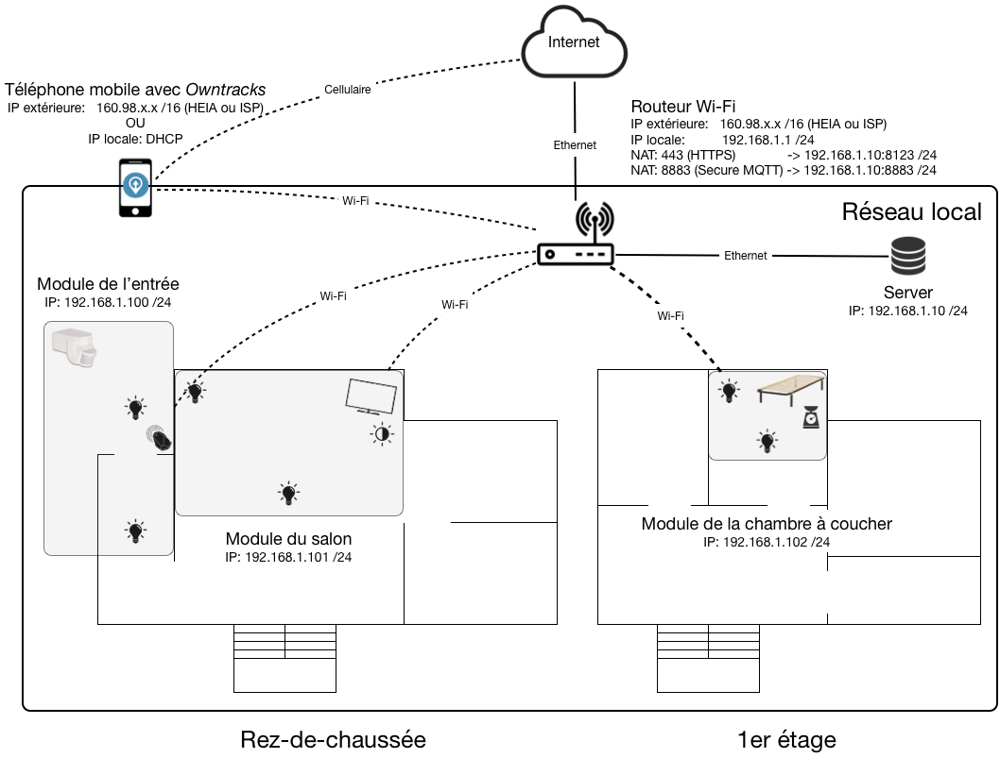
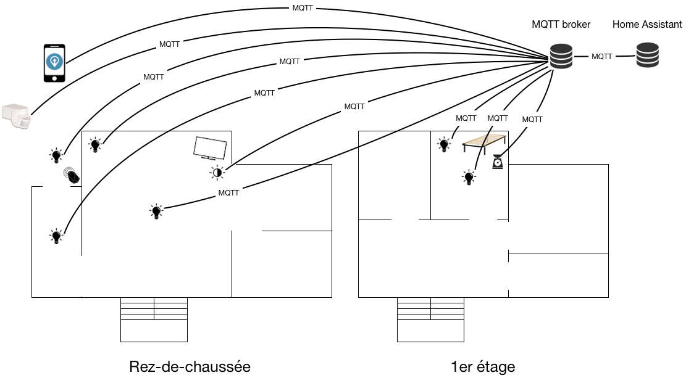
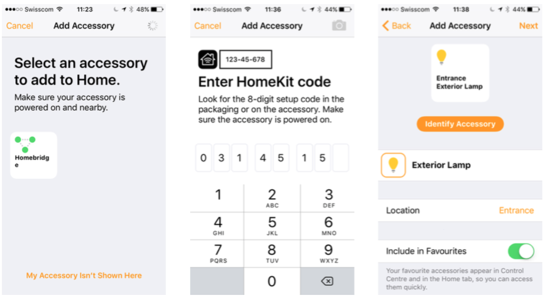
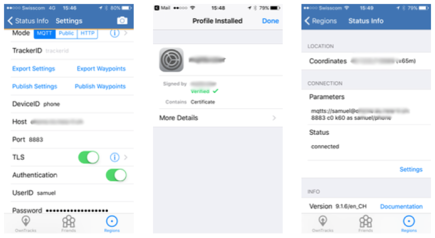

# HOME AUTOMATION WITH OPEN HARDWARE AND SOFTWARE


## Table of contents
1. [Introduction](#introduction)
2. [Automation](#automation)
3. [Parts list](#parts-list)
4. [Installation of the controller](#installation-of-the-controller)
5. [Installation of the extra components for Home Assistant](#installation-of-the-extra-components-for-homeassistant)
6. [Implementation of the actuators/sensors](#implementation-of-the-actuators/sensors)
7. [Creation of the automation rules](#creation-of-the-automation-rules)
8. [Demonstration](#demonstration)

## Introduction
Home Automation with Open Hardware and Software (a.k.a. OpenHome) was a school project made in a few weeks by a [student](https://www.linkedin.com/in/mertenats) at College of Engineering and Architecture of Fribourg, Switzerland ([HEIA](https://www.heia-fr.ch)).

### Context
The main goal of this project is to offer an Open Source alternative to commercialized solutions, like Samsung SmartThings or Philips Hue.

In this project, [Home Assistant](https://home-assistant.io) is used as the controller and the [MQTT](http://mqtt.org) protocol is used for the communication between the controller and the actuators/sensors.

The controller is installed on a Raspberry Pi 3 and the actuators/sensors are built on top of [NodeMCU](http://nodemcu.com/index_cn.html) boards (ESP8266).

### Architecture

Network architecture:


Note: For simplicity, a NodeMCU module is used to connect two lamps and a sensor. In reality, a module will be used for each lamp or sensor.

Application architecture:


## Automation
In this project, only the lightning is automated, based on the departure/arrival of the occupiers, the state of the television in the living room or the occupancy of the bed in the bedroom. The lightning is also used to simulate a presence when nobody's home.

Automation rule overview:

- Change the lightning when the TV is switched on or off
- Simulate the sunrise when the alarm clock rings
- Simulate the sunset when the person is going to bed
- Simulate a presence when nobody is at home

The rules are further explained in the chapter [Creation of the automation rules](#creation-of-the-automation-rules).

## Parts list
Hardware:

- 1 Wi-Fi router
- 1 Raspberry Pi
- 3 NodeMCU boards (or any module based on an ESP8266 chip)
- 2 RGB LEDs
- 4 White LEDs
- 1 PIR sensor (HC-SR501)
- 1 Load cell
- 1 Signal amplifier (HX711)
- 1 Photo-resistor
- 1 iBeacon
- 1 iOS device 

Software:

- Arduino IDE ([here](https://www.arduino.cc))
- ESP8266 core for Arduino ([here](https://github.com/esp8266/Arduino))
- MQTT library ([here](https://github.com/knolleary/pubsubclient))
- HX711 library ([hre](https://github.com/bogde/HX711))

## Installation of the controller
### Home Assistant
To install Home Assistant easily, a Raspberry Pi All-In-One Installer is available [here](https://home-assistant.io/getting-started/installation-raspberry-pi-all-in-one/). More recently, a Raspberry Pi image was released [here](https://home-assistant.io/blog/2016/10/01/we-have-raspberry-image-now/). This image comes pre-installed with everything we need to get started with Home Assistant. For this project, we just need Home Assistant and the Mosquitto MQTT broker, so I prefer to install everything manually.

First, we need to update the system and install some Python dependencies.

```
sudo apt-get update
sudo apt-get upgrade
sudo apt-get install python-pip python3-dev
sudo pip install --upgrade virtualenv
```

Then, we create a new system user, `hass`, to execute the service for Home Assistant. This is a good practice to reduce the exposure of the rest of the system and provide a more granular control over permissions.

```
sudo adduser --system hass
```

We create a new directory for Home Assistant and we change its ownership to the new created user.

```
sudo mkdir /srv/hass
sudo chown hass /srv/hass
```
We become the new user and we set up a virtual Python environment in the directory we just created. A virtual Python environment is a good practice to avoid interaction with the Python packages used by the system or by others applications. Then, we activate it.

```
sudo su -s /bin/bash hass
virtualenv -p python3 /srv/hass
source /srv/hass/bin/activate
```
And now we are ready to install Home Assistant.

```
pip3 install --upgrade homeassistant
```
Finally we can run Home Assistant by typing the command below.

```
sudo -u hass -H /srv/hass/bin/hass
```

For starting Home Assistant on boot, we need to create a service for `systemd`. Someone has already created one and we can just download it.

```
sudo wget https://raw.githubusercontent.com/home-assistant/home-assistant/master/script/home-assistant%40.service -O /etc/systemd/system/home-assistant@hass.service
```

This service needs a little modification. We have to replace `/usr/bin/hass`with `/srv/hass/bin/hass`. The line in question should look like this now `ExecStart=/srv/hass/bin/hass --runner`.

```
sudo nano /etc/systemd/system/home-assistant@hass.service
```

We need to reload `systemd`to make the daemon aware of the new configuration.

```
sudo systemctl --system daemon-reload
sudo systemctl enable home-assistant@hass
sudo systemctl start home-assistant@hass
```

To upgrade the system in the future, we just need to type the commands below.

```
sudo su -s /bin/bash hass
source /srv/hass/bin/activate
pip3 install --upgrade homeassistant
```

If HTTPS is used (link below), we need to add the following lines into the `configuration.yaml`file.

``` yaml
http:
  api_password: '[REDACTED]'
  ssl_certificate: '/etc/letsencrypt/live/[REDACTED]/fullchain.pem'
  ssl_key: '/etc/letsencrypt/live/[REDACTED]/privkey.pem'
```

Important files

- Configuration file: `/home/hass/.homeassistant/configuration.yaml`
- Logs file: `/home/hass/.homeassistant/home-assistant.log`

The entire configuration is available [here](configuration/home_assistant).

Optional steps:

- Allow a remote access to Home Assistant and protect the GUI with HTTPS ([here](https://home-assistant.io/blog/2015/12/13/setup-encryption-using-lets-encrypt/)).
- Use Tor to make remote access anonymous ([here](https://home-assistant.io/cookbook/tor_configuration/)).

Sources:

- [Installation in Virtualenv](https://home-assistant.io/getting-started/installation-virtualenv/)
- [Autostart Using Systemd](https://home-assistant.io/getting-started/autostart-systemd/)

### Mosquitto MQTT broker
To install the latest version of Mosquitto, we need to use their new repository.

```
wget http://repo.mosquitto.org/debian/mosquitto-repo.gpg.key
sudo apt-key add mosquitto-repo.gpg.key
```

Then we make the repository available to apt and update its informations.

```
cd /etc/apt/sources.list.d/
sudo wget http://repo.mosquitto.org/debian/mosquitto-jessie.list
sudo apt-get update
```

Finally we can install Mosquitto and its client, for testing purpose.

```
sudo apt-get install mosquitto mosquitto-clients
```

The MQTT protocol provides authentication and ACL functionalities to protect its use.
To create a username/password, we just need to use `mosquitto_passwd`.

```
cd /etc/mosquitto/conf.d/
sudo touch pwfile
sudo mosquitto_passwd pwfile ha
```

And to restrict publishing/subscribing, we need to create a `aclfile`, in which we specify the username and the relevant MQTT topics.

```
cd /etc/mosquitto/conf.d/
sudo touch aclfile
```

ACL examples:

```
user ha
topic write entrance/light1/switch topic write entrance/light2/switch
...
topic read entrance/light1/status
topic read entrance/light2/status
```

If MQTT over TLS (link below), username/password and ACL are used, we need to add the following lines into the `mosquitto.conf`file.

```
allow_anonymous false
password_file /etc/mosquitto/conf.d/pwfile
acl_file /etc/mosquitto/conf.d/aclfile
listener 8883 (optional)
cafile /etc/mosquitto/certs/ca.crt (optional)
certfile /etc/mosquitto/certs/raspberrypi.crt keyfile /etc/mosquitto/certs/raspberrypi.key (optional)
```

To link Home Assistant with the Mosquitto broker, the `configuration.yaml`file needs the lines below.

```yaml
mqtt:
  broker: 'localhost' #127.0.0.1
  port: 8883 #1883
  client_id: 'ha'
  username: 'ha'
  password: '[REDACTED]' (optional)
  certificate: '/etc/mosquitto/certs/ca.crt' (optional)
```

Important files:

- Configuration file: `/etc/mosquitto/conf.d/mosquitto.conf`
- Logs file: `/var/log/mosquitto/mosquitto.log`

The entire configuration is available [here](configuration/mosquitto).

Optional step:

- Protect MQTT over a secure TLS connection ([here](http://owntracks.org/booklet/guide/broker/)).

Source:

- [Mosquitto Debian repository](https://mosquitto.org/2013/01/mosquitto-debian-repository/
).

### Homebridge
The installation of Homebridge is not mandatory. Homebridge runs on Node.js and this language needs to be installed.

We start by verifying if `git`and `make`are already installed. It's normally the case on Raspbian Jessie.

```
sudo apt-get install git make
```

First, we have to install Node.js.

```
cd Downloads/
wget https://nodejs.org/dist/latest-v4.x/node-v4.6.0-linux-armv6l.tar.gz tar -xvf node-v4.6.0-linux-armv6l.tar.gz
cd node-v4.6.0-linux-armv6l/
sudo cp -R * /usr/local/
```
And install Avahi and dependencies.

```
sudo apt-get install libavahi-compat-libdnssd-dev screen
```

Finally we install Homebridge and dependencies.

```
sudo npm install -g --unsafe-perm homebridge hap-nodejs node-gyp
cd /usr/local/lib/node_modules/homebridge/
sudo npm install --unsafe-perm bignum
cd /usr/local/lib/node_modules/hap-nodejs/node_modules/mdns/ sudo node-gyp BUILDTYPE=Release rebuild
sudo npm install -g --unsafe-perm homebridge
```

To link Homebridge and Home Assistant together, we have to install this plugin.

```
sudo npm install -g homebridge-homeassistant
```

For starting Homebridge on boot, we need to create a service for `systemd`. Someone has already created one and we can just download it.

```
cd ~/Downloads
wget https://gist.githubusercontent.com/johannrichard/0ad0de1feb6adb9eb61a/raw/7defd3836f4fbe2b98ea5a97 49c4413d024e9623/homebridge
wget https://gist.githubusercontent.com/johannrichard/0ad0de1feb6adb9eb61a/raw/7defd3836f4fbe2b98ea5a97 49c4413d024e9623/homebridge.service
sudo cp homebridge /etc/default/
sudo cp homebridge.service /etc/systemd/system
```

Then we create a new system user, `homebridge`, to execute the service for Homebridge. We create also a folder `/var/homebridge` for the configuration file.

```
sudo adduser --system homebridge
sudo mkdir /var/homebridge
sudo chown homebridge /var/homebridge
```

We need to create a configuration file for Homebridge. This file will be located in `/var/homebridge`, with the content displayed below.

```
sudo nano /var/homebridge/config.json
```

config.json:

```
{
  "bridge": {
    "name": "Homebridge",
    "username": "CC:22:3D:E3:CE:30",
    "port": 51826,
    "pin": "031-45-154"
  },
  "description": "homebridge-homeassistant",
  "platforms": [
    {
      "platform": "HomeAssistant",
      "name": "HomeAssistant",
      "host": "https://[Redacted]",
      "password": "[Redacted]",
      "supported_types": ["fan", "garage_door", "input_boolean", "light", "lock", "media_player", "rollershutter", "scene", "switch"]
    }
  ]
}
```

We need to reload `systemd`to make the daemon aware of the new configuration.

```
sudo systemctl daemon-reload
sudo systemctl enable homebridge
sudo systemctl start homebridge
```

At the end, the Homebridge bridge should be visible inside Apple's Home application.

Configuration of Homebridge in the Apple Home application:



Sources:

- [Running HomeBridge on a Raspberry Pi](https://github.com/nfarina/homebridge/wiki/Running-HomeBridge-on-a-Raspberry-Pi)
- [Installing Node.js on a Raspberry Pi 3](https://blog.wia.io/installing-node-js-on-a-raspberry-pi-3)
- [Home Assistant for Homebridge](https://github.com/home-assistant/homebridge-homeassistant)

## Installation of the extra components for Home Assistant
Some extra components have to be installed for providing notifications (with Telegram) with weather conditions (with Forecast.io) to the user and for detecting when the user when is entering/leaving the house (with Owntracks and an iBeacon).

### Telegram
To use Telegram we need to create a bot. The procedure is discribed [here](https://core.telegram.org/bots).

Configuration for Home Assistant:

```yaml
notify:
  platform: telegram
  api_key: [Redacted]
  chat_id: [Redacted]
```
### Forcast.io
To use the data from Forecast.io a [account](http://forecast.io) is necessary to retrieve a `api_key`. 

Configuration for Home Assistant:

```yaml
sensor:
  platform: forecast
  api_key: [Redacted]
  monitored_conditions:
    - precip_probability
    - temperature
    - wind_speed
    - cloud_cover
    - humidity
    - pressure
    - temperature_max
    - precip_intensity_max
```
### Owntracks
Configuration for Home Assistant:

```yaml
device_tracker:
  platform: owntracks
```
Configuration for the Owntracks application:


Note: The MQTT broker must be accessible from outiside the local network and provide a SSL/TLS secure connexion.

Sources:

- [Telegram](https://home-assistant.io/components/notify.telegram/)
- [Forecast.io](https://home-assistant.io/components/sensor.forecast/)
- [Owntracks](https://home-assistant.io/components/device_tracker.owntracks/)

## Implementation of the actuators/sensors
The sketches are available [here](sketches). Before using them, we need to modify the Wi-Fi SSID/password, the MQTT username/password, the desired IP address ant the OTA password. The use of TLS is optional.

```C
// Wi-Fi: Access Point SSID and password
const char*       AP_SSID           = "[Redacted]";
const char*       AP_PASSWORD       = "[Redacted]";
...
const char*       MQTT_USERNAME     = "entrance";
const char*       MQTT_PASSWORD     = "[Redacted]";
...
// TLS: The fingerprint of the MQTT broker certificate (SHA1)
#ifdef TLS
// openssl x509 -fingerprint -in  <certificate>.crt
const char*       CA_FINGERPRINT    = "[Redacted]";
// openssl x509 -subject -in  <certificate>.crt
const char*       CA_SUBJECT        = "[Redacted]";
#endif
...
const char*       OTA_PASSWORD      = "[Redacted]";
```

### Entrance
#### Schematic

LED on the left:

- Shortest leg to GND
- Longuest leg to D1, with a 220 Ohms resistor
 
LED on the right:

- Shortest leg to GND
- Longuest leg to D2, with a 220 Ohms resistor

PIR sensor:

- Red cable to VIN
- Yellow cable to D3
- Black cable to GND
   

#### Configuration for Home Assistant

```yaml
light:
    # lamp 1
  - platform: mqtt
    name: 'Lamp 1'
    state_topic: 'entrance/light1/status'
    command_topic: 'entrance/light1/switch' optimistic: false
    # lamp 2
  - platform: mqtt
    name: 'Lamp 2'
    state_topic: 'entrance/light2/status'
    command_topic: 'entrance/light2/switch' optimistic: false

binary_sensor:
  platform: mqtt
  name: 'Motion'
  state_topic: 'entrance/door/motion/status'
  sensor_class: motion
```
### Living room
#### Schematic
LED on the left:

- Longest leg to GND
- Leg on the left to D1, with a 220 Ohms resistor
- Leg on the middle to D2, with a 220 Ohms resistor
- Leg on the right to D3, with a 220 Ohms resistor

LED on the right:

- Shortest leg to GND
- Longest leg to D4, with a 220 Ohms resistor

Photo-resistor:

- One leg to VCC
- The other leg to GND, with a 10K Ohms resistor and a cable to A0


#### Configuration for Home Assistant

```yaml
light:
    # lamp 3 (RGB)
  - platform: mqtt
    name: 'Lamp 3'
    state_topic: 'livingroom/light1/status'
    command_topic: 'livingroom/light1/switch'
    brightness_state_topic: 'livingroom/light1/brightness/status'
    brightness_command_topic: 'livingroom/light1/brightness/set'
    rgb_state_topic: 'livingroom/light1/color/status'
    rgb_command_topic: 'livingroom/light1/color/set'
    optimistic: false

    # lamp 4
  - platform: mqtt
    name: 'Lamp 4'
    state_topic: 'livingroom/light2/status'
    command_topic: 'livingroom/light2/switch'
    optimistic: false
binary_sensor:
  platform: mqtt
  name: 'TV'
  state_topic: 'livingroom/tv/status'
```
### Bedroom
#### Schematic

LED on the left:

- Longest leg to GND
- Leg on the left to D1, with a 220 Ohms resistor
- Leg on the middle to D2, with a 220 Ohms resistor
- Leg on the right to D3, with a 220 Ohms resistor

LED on the right:

- Shortest leg to GND
- Longest leg to D4, with a 220 Ohms resistor

Load cell to HX711:

- Red cable to E+ 
- Black cable to E- 
- White cable to A- 
- Green cable to A+ 

HX711:

- VCC to VCC
- GND to GND
- SCK to D6
- DT to D5


#### Configuration for Home Assistant

```yaml
light:
    # lamp 5 (RGB)
  - platform: mqtt
    name: 'Lamp 5'
    state_topic: 'bedroom/light1/status'
    command_topic: 'bedroom/light1/switch'
    brightness_state_topic: 'bedroom/light1/brightness/status'     
    brightness_command_topic: 'bedroom/light1/brightness/set'
    rgb_state_topic: 'bedroom/light1/color/status'
    rgb_command_topic: 'bedroom/light1/color/set'
    optimistic: false
    # lamp 6
  - platform: mqtt
    name: 'Lamp 6'
    state_topic: 'bedroom/light2/status'
    command_topic: 'bedroom/light2/switch'
    optimistic: false

binary_sensor:
  platform: mqtt
  name: 'Occupancy'
  state_topic: 'bedroom/bed/occupancy/status' sensor_class: occupancy
```
## Creation of the automation rules
### Entrance

| Scenario | Description           | File  |
| -------- |-------------| -----|
| 1a       | Turn on the light 1 when a person is detected if nobody's home, the sun is below and the person is unknown | [here](configuration/home_assistant/automation/automation_1a.yaml) |
| 1b       | Turn on the lights 1 & 2 when a person is detected if a occupier's at home, the sun is below and the person is unknown | [here](configuration/home_assistant/automation/automation_1b.yaml) |
| 1c       | Turn on the lights 1, 2 & 4 when a occupier of the home is detected if the sun is below and it's before 22:30 | [here](configuration/home_assistant/automation/automation_1c.yaml) |
| 1d       | Turn on the lights 1, 2, 5 & 6 when a occupier of the home is detected if the sun is below and it's after 22:30 | [here](configuration/home_assistant/automation/automation_1d.yaml) |

### Living room

| Scenario | Description           | File  |
| -------- |-------------| -----|
| 2a       | Set the brightness of the light 3 to 50% and turn off the light 4 when the TV is turned on if the sun is below | [here](configuration/home_assistant/automation/automation_2a.yaml) |
| 2b       | Set the brightness of the light 3 to 75% when the TV is turned off if the sun is below | [here](configuration/home_assistant/automation/automation_2b.yaml) |

### Bedroom

| Scenario | Description           | File  |
| -------- |-------------| -----|
| 3a       | Simulate a sunrise with the light 5 when the alarm clock rings, switch off the light 5 and switch on the light 6, send the weather conditions to the user| [here](configuration/home_assistant/automation/automation_3a.yaml) |
| 3b       | Simulate a sunset when the occupier is detected in its bed, switch off all the others lights| [here](configuration/home_assistant/automation/automation_3b.yaml) |

### Presence simulation

| Scenario | Description           | File  |
| -------- |-------------| -----|
| 4a       | Simulate a presence when nobody's home | [here](configuration/home_assistant/automation/automation_4a.yaml) |

## Demonstration
Features:

- Change the lightning when the TV is switched on or off
- Simulate the sunrise when the alarm clock rings
- Simulate the sunset when the person is going to bed
- Simulate a presence when nobody is at home
- Control the system with Apple Home application and Siri

[](https://www.youtube.com/watch?v=Vh-vzFPCF2U "OpenHome with Home Assistant and MQTT")
